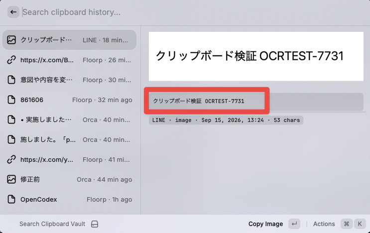
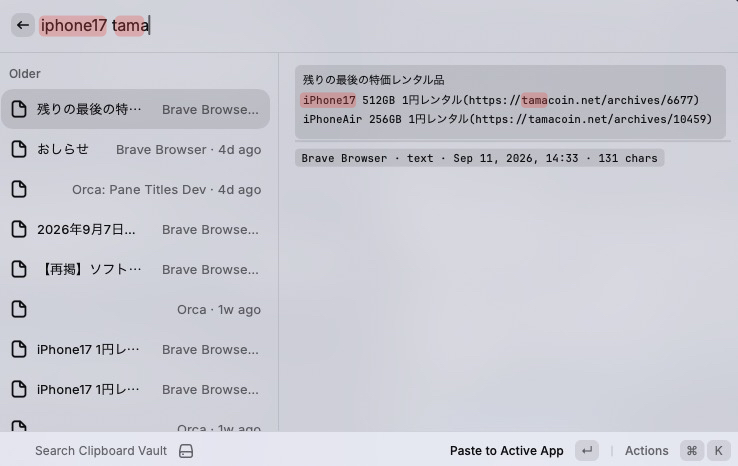

# Clipboard Vault 📋

**Free, unlimited clipboard history for macOS + Raycast.**

No subscriptions. No Raycast Pro. No cloud. Just a Swift daemon that watches your clipboard and a Raycast extension to search and paste.

> This fork of [kandotrun/raycast-clipboard-extension-its-free](https://github.com/kandotrun/raycast-clipboard-extension-its-free) adds **text search inside images (on-device OCR)**, **multi-keyword AND search**, and an importer for Raycast's built-in clipboard history.

| Search text inside images | Multi-keyword AND search |
|---|---|
|  |  |

## What is this?

Raycast's built-in clipboard history is limited unless you pay $10/month for Raycast Pro. This project gives you **unlimited clipboard history** for free:

1. **Swift Daemon** — Runs in the background, monitors `NSPasteboard`, saves everything to a local SQLite database
2. **Raycast Extension** — Searches the database and lets you paste from history, just like the native clipboard history

## Features

- ♾️ **Unlimited history** — No cap on entries, ever
- 🖼️ **Image support** — Screenshots and copied images saved as PNG with preview
- 🔍 **Full-text search** — Find anything you've ever copied
- 🔎 **Search text inside images** — Screenshots and copied images are OCR'd on-device with Apple Vision (Japanese + English), so their text is searchable too
- ➕ **Multi-keyword AND search** — `iphone17 tama` matches entries containing both words (space or full-width space separated)
- 📌 **Pin entries** — Keep important items at the top
- 🏷️ **Auto-detect content type** — URLs, emails, file paths, images, plain text
- 📱 **Source app tracking** — Know where you copied from
- 🔒 **Password manager exclusion** — Automatically skips 1Password, Bitwarden, Keychain Access
- ⚡ **Fast** — SQLite + WASM. No network calls. No cloud.
- 🖥️ **Fully local** — Your data never leaves your machine

## Setup

### 1. Build the daemon

```bash
cd daemon
swiftc ClipboardVault.swift -o clipboard-vault -framework Cocoa -framework Foundation -framework Vision -O
```

### 2. Install the daemon

```bash
# Copy the binary
mkdir -p ~/.local/bin
cp clipboard-vault ~/.local/bin/

# Install the LaunchAgent (auto-start on login)
cp com.kandotrun.clipboard-vault.plist ~/Library/LaunchAgents/

# Edit the plist if needed — update the binary path to ~/.local/bin/clipboard-vault

# Start the daemon
launchctl load ~/Library/LaunchAgents/com.kandotrun.clipboard-vault.plist
```

### 3. Install the Raycast extension

```bash
cd raycast-extension
npm install
npm run build
```

Then in Raycast:
1. Open Raycast → search "Import Extension"
2. Select the `raycast-extension` folder
3. Done!

### 4. Set up the hotkey (optional)

Go to **Raycast Settings → Extensions → Clipboard Vault → Search Clipboard Vault** and assign `⌘⇧C` (or whatever you prefer).

## Usage

| Action | Shortcut |
|--------|----------|
| Paste to active app | `Enter` |
| Copy image to clipboard | `Enter` (for image entries) |
| Copy to clipboard | `⌘ Enter` |
| Pin / Unpin | `⌘⇧P` |
| Delete entry | `⌘ Delete` |

## Search

- Separate keywords with spaces (half- or full-width). Every keyword must match — e.g. `iphone17 tama`.
- Keywords match both the copied text and the OCR text of images. Line breaks in OCR text are ignored when matching, so words that wrap across lines in a screenshot are still found.
- Image entries use the first OCR line as their title and show the full OCR text under the preview. `⌘⇧T` copies the OCR text.

## Image Support

The daemon captures images from the clipboard (screenshots, copied images) and saves them as PNG files to `~/.clipboard-vault/images/`. The Raycast extension shows image previews in the detail panel and lets you copy images back to the clipboard.

- Images are checked before text (screenshots often set both)
- Duplicate detection uses a hash of the first 8KB + total size
- Images are stored as PNG regardless of the original format
- Each image is OCR'd right after capture using the Vision framework, fully offline. The result is stored in the `ocr_text` column
- Existing images without OCR text are backfilled in the background, newest first (about 1s per image), and re-checked every 60 seconds

## Configuration

The daemon creates a config file at `~/.clipboard-vault/config.json` on first run:

```json
{
  "dbPath": "~/.clipboard-vault/clipboard.db",
  "excludedApps": ["Keychain Access", "1Password", "Bitwarden"]
}
```

Add any app names to `excludedApps` to prevent their clipboard data from being saved.

## Importing Raycast's built-in clipboard history

Migrate your existing Raycast clipboard history (text, links, images) into the vault:

1. In Raycast, run **Export Settings & Data** and save the `.rayconfig` (note the export password).
2. Stop the daemon:
   ```sh
   launchctl bootout gui/$(id -u)/com.kandotrun.clipboard-vault
   ```
3. Run the importer (Node 22+, uses the built-in `node:sqlite`):
   ```sh
   node scripts/import-raycast.mjs <path-to.rayconfig> --password <export-password>
   ```
   Options: `--dry-run` (report only), `--no-images` (skip images).
4. Restart the daemon:
   ```sh
   launchctl bootstrap gui/$(id -u) ~/Library/LaunchAgents/com.kandotrun.clipboard-vault.plist
   ```

Duplicates are skipped (text uses the same hash as the daemon), and images are copied into
`~/.clipboard-vault/images/`. Delete the `.rayconfig` afterwards — it contains your full history.

## Architecture

```
┌─────────────────┐     ┌──────────────────┐     ┌─────────────────┐
│  NSPasteboard   │────▶│  Swift Daemon     │────▶│  SQLite DB      │
│  (system)       │     │  (0.5s polling)   │     │  (~/.clipboard- │
│                 │     │  text + images    │     │   vault/)       │
└─────────────────┘     └──────────────────┘     └────────┬────────┘
                                                          │
                              ┌────────────────┐          │ reads
                              │  PNG images    │          │
                              │  (~/.clipboard-│          │
                              │   vault/images)│          │
                              └────────────────┘          │
                                                          ▼
                                                 ┌─────────────────┐
                                                 │  Raycast Ext    │
                                                 │  (sql.js WASM   │
                                                 │   + React)      │
                                                 └─────────────────┘
```

## Uninstall

```bash
# Stop and remove the daemon
launchctl unload ~/Library/LaunchAgents/com.kandotrun.clipboard-vault.plist
rm ~/Library/LaunchAgents/com.kandotrun.clipboard-vault.plist
rm ~/.local/bin/clipboard-vault

# Remove data
rm -rf ~/.clipboard-vault

# Remove Raycast extension via Raycast preferences
```

## Requirements

- macOS 13+ (Japanese OCR requires the macOS 13 Vision text recognizer)
- Swift (included with Xcode or Command Line Tools)
- Node.js 18+ (for building the Raycast extension)
- [Raycast](https://raycast.com/) (free tier is fine!)

## License

MIT
